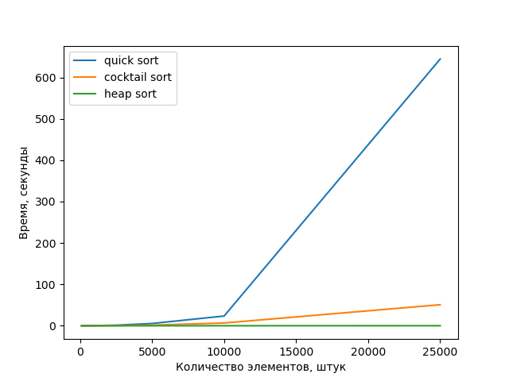

# methprog-3-year
```
  #  =====================================================================================================
  # 	 ﾞ☆ﾞ            ﾞ☆ﾞ            ﾞ☆ﾞ            ﾞ☆ﾞ            ﾞ☆ﾞ            ﾞ☆ﾞ
  #   ／|、         ﾞ☆ﾞ            ﾞ☆ﾞ            ﾞ☆ﾞ            ﾞ☆ﾞ            ﾞ☆ﾞ            ﾞ☆ﾞ
  # （ﾟ､ ｡ つ               ﾞ☆ﾞ             ﾞ☆ﾞ               ﾞ☆ﾞ            ﾞ☆ﾞ              ﾞ☆ﾞ              ﾞ☆ﾞ
  #  |、ﾞ  ヽ        ﾞ☆ﾞ            ﾞ☆ﾞ            ﾞ☆ﾞ            ﾞ☆ﾞ            ﾞ☆ﾞ            ﾞ☆ﾞ
  #  じーし__ )つ            ﾞ☆ﾞ            ﾞ☆ﾞ            ﾞ☆ﾞ            ﾞ☆ﾞ            ﾞ☆ﾞ            ﾞ☆ﾞ
  #  =====================================================================================================
  #  МЕТОДЫ ПРОГРАММИРОВАНИЯ | LAB 1 10.03.2023 | ВАРИАНТ 12
  #  by crytech7
  #  =====================================================================================================
  #  > ВАРИАНТ 12:
  # 	Массив данных о командах, принимающих участие в  чемпионате страны по футболу:
  # 	страна, название клуба,  город, год, ФИО главного тренера
  # 	(сравнение по полям – год, страна, количество набранных очков (по убыванию), название клуба):

  #       Country,Club Name,City,Year,Coach Name,Points

  #  > СОРТИРОВКИ:
  # 	г) Шейкер-сортировка
  # 	д) Пирамидальная сортировка
  # 	е) Быстрая сортировка
  #  ====================================================================================================
```



## Usage
```
  git clone https://github.com/crytech7/methprog-3-year
  cd methprog-3-year
  python3 generate.py
  python3 main.py
  python3 do_graphs.py
```
